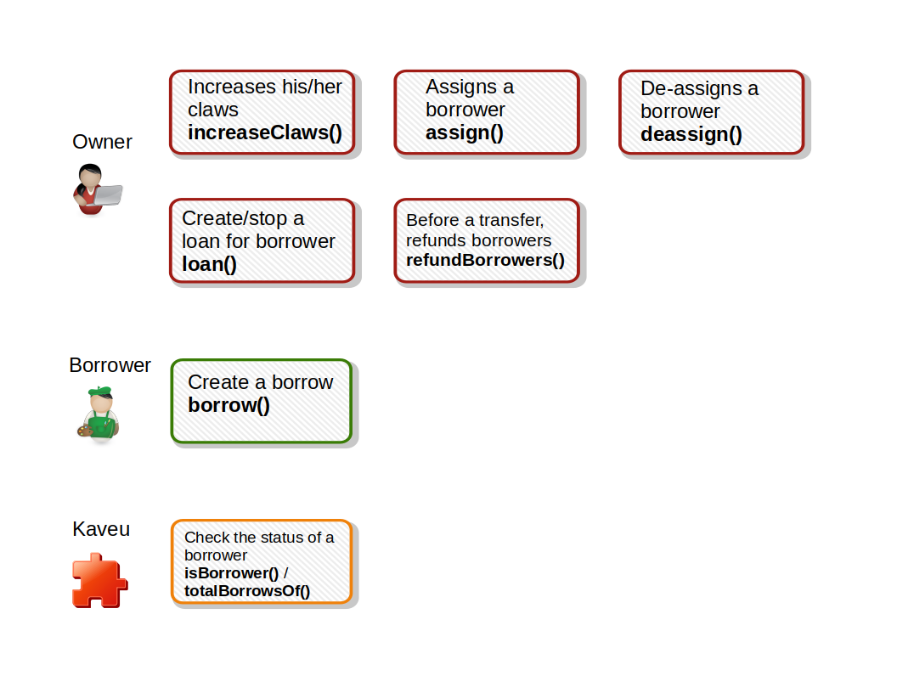

# Kaveu core

This has been created using the `hardhat init`.
<p>
  
  
</p>

## Networks

|Network name|Address|
|-----|-----|
|**Mumbai**|[0xf46f27ca5D858103e7ad5D7dFd4556786010d2f8](https://mumbai.polygonscan.com/address/0xf46f27ca5D858103e7ad5D7dFd4556786010d2f8#code "The contract code")|

## Installing

```bash
yarn
```

## Compile the contract

```bash
yarn compile
```

## Deploy the contract

```bash
yarn deploy
```

## Test the contract

```bash
yarn test
```

## Diagram


## License

Distributed under the MIT License. See [LICENSE](LICENSE) for more information.
